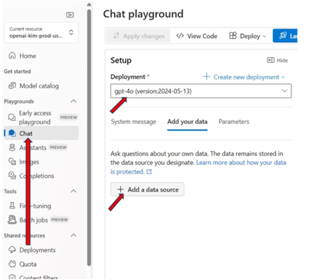

# Create Open AI

**1. Search for Azure AI Services** &#x20;

To set up Azure AI services, the easiest way is to click on the search bar and look for 'Azure AI Services.' After doing this, click on the '+ Create' button.&#x20;

<figure><figcaption>
Creating Open AI
</figcaption></figure>

**2. Create a New AI Service**&#x20;

You will be prompted to choose a subscription, create or select a resource group, and specify the region where you want the service hosted. Choose a service name and pick a pricing tier based on your needs, balancing cost and features. Point (2), (3) and (4) are not important.&#x20;

<figure><figcaption>
Creating
</figcaption></figure>

**3. Depoloying Model**&#x20;

After setting up Azure AI services, click on "Go to Azure OpenAI Studio" at the top of the page to continue.&#x20;

<figure><figcaption>
Open AI Studio
</figcaption></figure>

Next, navigate to the left sidebar and select "Deployments." Then, click on "+ Deploy model." Choose your desired model from the list and give it a unique name.

<figure><figcaption>
Managing
</figcaption></figure>

**4. Chat playground**&#x20;

Now, click on "Chat" in the left sidebar and select your setup deployment. The next step is to add data for the chatbot, so click on "Add a data source".&#x20;

<figure><figcaption>
Playground
</figcaption></figure>

**5. Add data**

After that, you need to select or add a data source. Fill in the columns as shown in the picture below or customize them according to your preferences.

<figure><figcaption></figcaption></figure>

In the Data Management section, you can select your "Search type." Choose "Keywords" to enable the AI to understand and process your requests effectively.

<figure><figcaption>
Data Management
</figcaption></figure>

In the "Data Connection" tab, you can select your Azure resource authentication type. For this example, choose "API" as your authentication method.

<figure><figcaption>
Data Connection
</figcaption></figure>

After finishing the setup, you will see the data you added shown in the interface. You can now test the AI by typing your questions in the chat on the right. The AI will look at your requests and give answers based on the data you provided.
