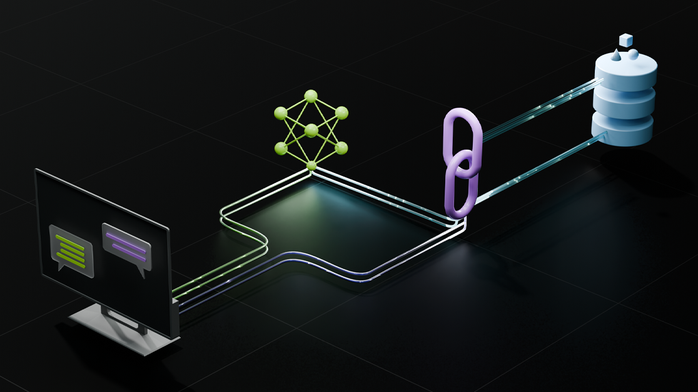

# RAG

What is RAG?

RAG stands for Retrieval-Augmented Generation and refers to a technique in artificial intelligence that combines the strengths of information retrieval and text generation.&#x20;

**Here are the key points about RAG: Information retrieval:**&#x20;

When you ask a question, the RAG model first searches an external database or knowledge source for relevant information, much like a search engine.&#x20;

**Combination of data:** It retrieves the information it finds and combines it with its own knowledge that it has learned during training.&#x20;

**Generating an answer:** Finally, the model creates an answer that uses both the retrieved information and its own knowledge to provide a precise and contextual answer.&#x20;

Essentially, RAG uses the best parts of knowledge retrieval and text generation to provide informed answers.

<figure><figcaption>
RAG-Pipeline
</figcaption></figure>
